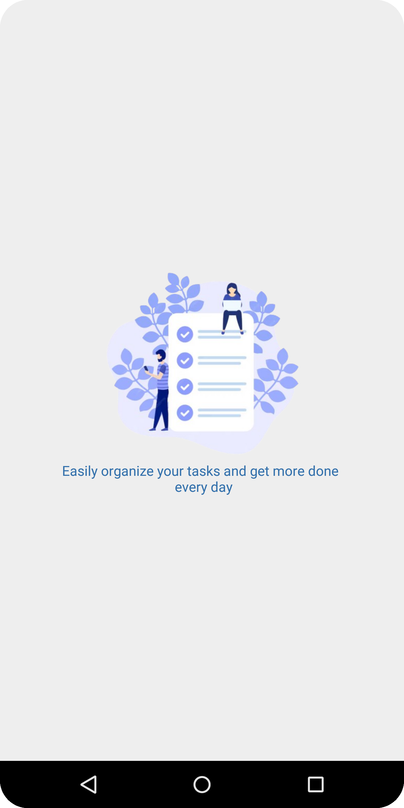
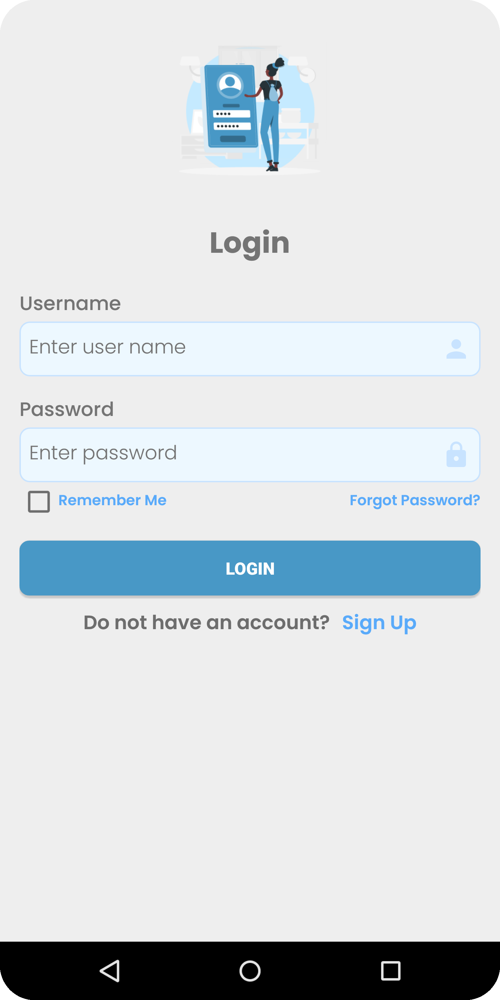
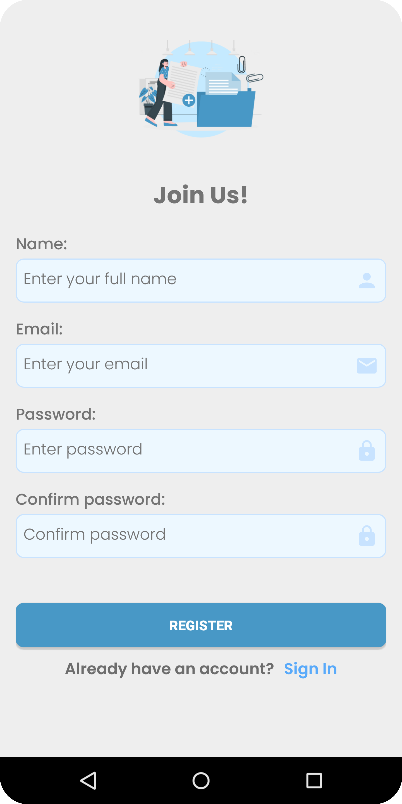
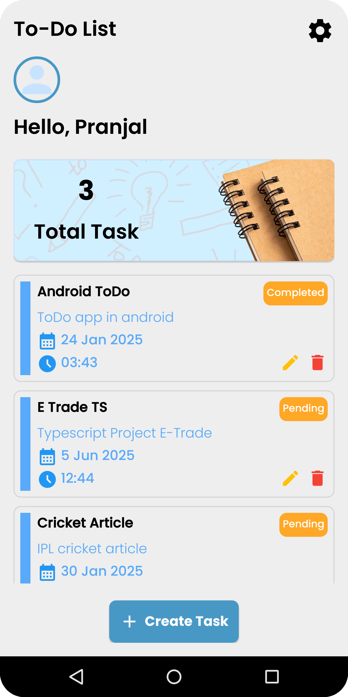
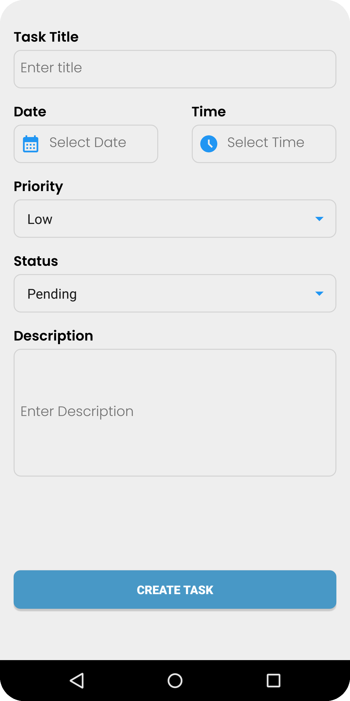
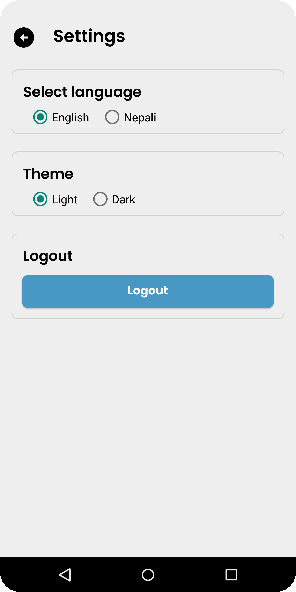

# To-Do App 📝

A simple Android To-Do application. This app allows users to create, edit, delete, and track tasks with features like priority, status, and due dates. It also supports multi-language (English and Nepali) and
theme customization (Light and Dark).

---

## Features ✨

- **User Authentication**: Login and Register functionality.
- **Task Management**: Create tasks with title, description, priority, status, due date, and time. Edit and delete tasks. View all tasks in a RecyclerView.
- **Priority and Status**: Set task priority (e.g., High, Medium, Low). Update task status (e.g., Pending and Completed).
- **Due Date and Time**: Select due dates using a DatePicker. Set due times using a TimePicker.
- **Multi-Language Support**: Supports English and Nepali languages.
- **Theme Customization**: Switch between Light and Dark themes.
- **User-Friendly UI**: Clean and intuitive design with smooth navigation.
- **Persistence**: Tasks and user data are stored locally using Room Database.

---

## Screenshots 📸

| Splash Screen | Login Screen | Register Screen |
|---------------|--------------|-----------------|
|  |  |  |

| Home Screen | Create Task Screen | Settings Screen |
|-------------|--------------------|-----------------|
|  |  |  |

---

## Technologies Used 🛠️

- **Android SDK**: Core framework for building the app.
- **Java**: Primary programming language.
- **Room Database**: For local data persistence.
- **SharedPreferences**: For storing user preferences like theme and language.
- **RecyclerView**: For displaying the list of tasks.
- **DatePicker & TimePicker**: For selecting due dates and times.

---

## Installation 🚀

1. **Clone the repository**:
   ```bash
   git clone https://github.com/your-username/your-repo-name.git
2. Open the project in **Android Studio.**
3. **Build and run** the app on an Android emulator or physical device.

---

## Usages 🖥️

1. **Register** a new account or **Login** if you already have one.
2. **Create a new task** by clicking the "Create Task" button.
3. Fill in the task details (title, description, priority, status, due date, and time).
4. **View your tasks** on the home screen.
5. **Edit or delete tasks** by clicking the respective icons on the task item.
6. **Change language or theme** from the Settings screen.
